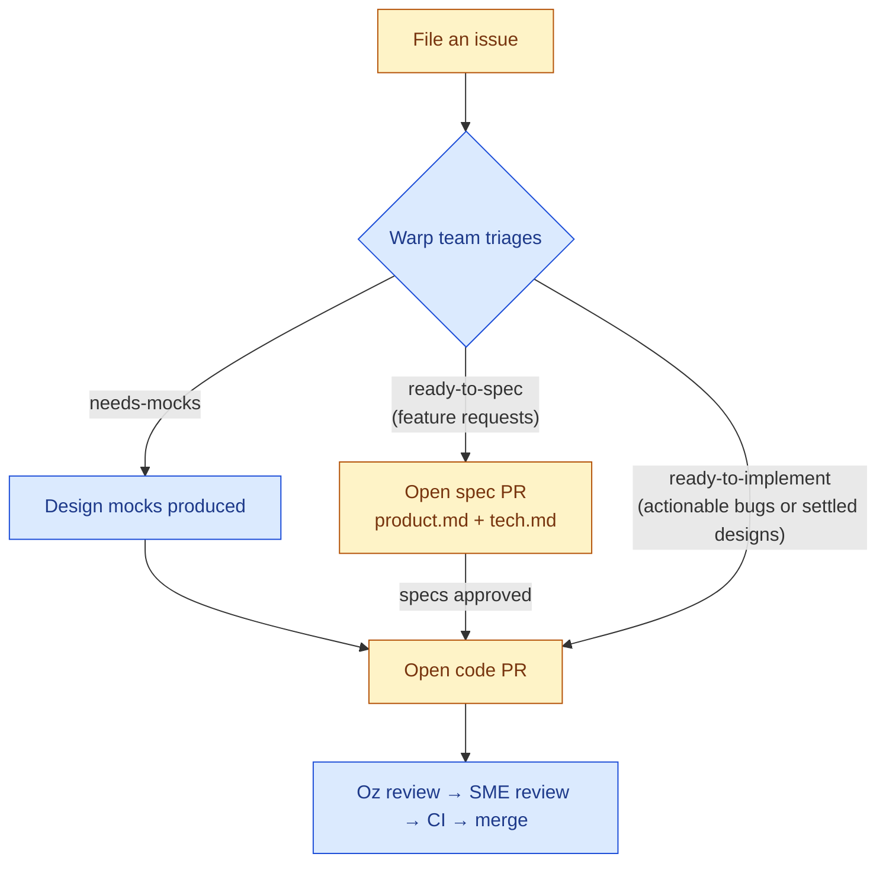

# Contributing to Warp

Thanks for helping improve Warp! This guide explains how to open issues, propose changes, and get your work reviewed.

> [!TIP]
> **Chat with us in Slack.** Connect with other contributors and the Warp team in the [`#oss-contributors`](https://warpcommunity.slack.com/archives/C0B0LM8N4DB) channel — a good place for ad-hoc questions, design discussion, and pairing with maintainers as you work through an issue or PR. New here? [Join the Warp Slack community](https://go.warp.dev/join-preview) first, then hop into `#oss-contributors`.

## TL;DR

- Bug fixes are welcome once the report is actionable from the provided details or maintainer triage.
- Feature requests must be marked `ready-to-spec` or `ready-to-implement` before PRs are accepted.
- Issues marked `warp:reserved-internal` are being handled by the Warp team and are not open for contributor PRs.
- Specs are the place where technical and design discussion on larger issues happen.
- Oz automatically triages incoming issues and reviews open PRs.
- Implementation PRs must include proof of manual testing.

## How Contributing to Warp Works

Warp's contribution model is shaped by [Oz](https://oz.warp.dev), an agent that automates parts of triage, spec writing, implementation, and review. Compared with a typical open-source repository, a few things work differently here:

- **Issues are the starting point for everything.** Discussion, scoping, and design happen on the issue before any PR is opened.
- **Feature requests differ from bug fixes:**
  - Features are gated by readiness labels — `ready-to-spec`, then `ready-to-implement` once the design is settled — that signal when contributors can pick up the work. Discussion alone is not approval to begin work.
  - Feature work needs a written spec first: feature requests go through a spec PR (a *product spec* + *tech spec* committed under [`specs/`](specs/)) before any code is written.
  - Bug fixes can go straight to a code PR once the report is reproducible or otherwise actionable; they do not require spec PRs unless the scope or design is unclear.
- **Review is largely automated.** When you open a PR, Oz is auto-assigned and produces an initial review. Once Oz approves, it automatically requests a follow-up review from a Warp team subject-matter expert — you do not need to assign human reviewers yourself.

### Readiness labels

The Warp team applies one of the following labels when an issue is ready for contribution:

- **`ready-to-spec`** — The problem is understood but the design is open. Open a spec PR with a *product spec* (`product.md`) and a *tech spec* (`tech.md`) under [`specs/`](specs/) — see [Opening a Spec PR](#opening-a-spec-pr) for what goes in each. This label is **reserved for feature requests**.
- **`ready-to-implement`** — The issue is ready for a code PR. For bugs, this means the report is sufficiently reproducible or actionable and the likely fix does not need a spec, mocks, or deeper investigation.
- **`needs-mocks`** — Design mocks are required before implementation can begin. Wait for the Warp team to land them.
- **`warp:reserved-internal`** — The Warp team is reserving this work for internal implementation or alignment. Do not open a spec or code PR for issues with this label; Oz will reject contributor PRs linked to them with an explanatory comment.

Anyone can pick up a ready issue — readiness labels are not assignments, and the best implementation wins through normal review. If an issue has been sitting un-triaged or you'd like readiness re-evaluated, mention **@oss-maintainers** in a comment to flag it for the team.

## Contribution Flow

Steps owned by you (the contributor) are shown in yellow; steps owned by the Warp team or Oz are shown in blue.



## Filing a Good Issue

Search [existing issues](https://github.com/warpdotdev/warp/issues) before filing to avoid duplicates. Use the issue templates when filing.

If you're already running Warp, the fastest way to file is the `/feedback` command — it opens a public GitHub issue with relevant context (logs, environment details) automatically attached.

### Bug reports

A good bug report includes:

- A clear title and a one-paragraph summary of the problem.
- Steps to reproduce (with a minimal example where possible).
- Expected vs. actual behavior.
- Warp version and OS (see `Settings → About`).
- Logs, screenshots, or screen recordings when relevant.

Once an issue is triaged as an actionable bug (by Oz's triage agent or a maintainer), it may be labeled **`ready-to-implement`** so you can pick it up and open a code PR.

### Feature requests

A good feature request describes the user-facing problem before any proposed implementation. Include:

- The user need or pain point, and who experiences it.
- The current behavior and why it falls short.
- A sketch of the desired behavior or workflow (a short example or mock is helpful but not required).
- Any relevant constraints (compatibility, related features, prior art, etc.).

Feature requests are the path that goes through the spec flow: a maintainer applies **`ready-to-spec`** when the problem is understood and the design is open for contributors. From there, the next step is a spec PR — not a code PR.

Automated triage may add informational labels (`area:*`, `repro:*`, etc.). Those do not affect readiness.

## Opening a Spec PR

Issues labeled `ready-to-spec` need a spec before code can begin. A spec consists of two short documents committed under [`specs/GH<issue-number>/`](specs/):

- **`product.md`** (the *product spec*) — Defines the desired behavior from the consumer's perspective (the user, an API caller, a CLI user, etc.) and stays out of implementation detail. The core is a numbered list of **testable behavior invariants** covering the happy path, user-visible states, inputs and responses, and edge cases (empty / error / loading, cancellation, offline, permission denied, races, accessibility). Optional sections: problem statement, goals / non-goals, Figma link, open questions.
- **`tech.md`** (the *tech spec*) — The implementation plan, grounded in this codebase. Required sections: **Context** (the current system and relevant files with line references), **Proposed changes** (modules touched, new types / APIs / state, data flow, tradeoffs), and **Testing and validation** (how each invariant from the product spec will be verified). Optional: end-to-end flow, Mermaid diagrams, risks, parallelization, follow-ups.

The spec-writing skills are sourced from [`warpdotdev/common-skills`](https://github.com/warpdotdev/common-skills), not authored directly in this repository. This checkout pins the expected versions in [`skills-lock.json`](skills-lock.json), and the bootstrap scripts can restore them for you:

- `./script/bootstrap` installs or updates common skills by default and prompts for a project-local or global install target when needed.
- `./script/bootstrap --install-common-skills-in-repo` installs the pinned common skills into this checkout's `.agents/skills/`.
- `./script/bootstrap --install-common-skills-globally` installs the pinned common skills into `~/.agents/skills/`.
- `WARP_COMMON_SKILLS_INSTALL_TARGET=project ./script/bootstrap` and `WARP_COMMON_SKILLS_INSTALL_TARGET=global ./script/bootstrap` select the same targets non-interactively.
- `./script/bootstrap --skip-common-skills` leaves common skills untouched if you are managing them separately.

To open a spec PR:

1. Add `specs/GH<issue-number>/product.md` and `specs/GH<issue-number>/tech.md`. See [`specs/GH408/`](specs/GH408/), [`specs/GH1063/`](specs/GH1063/), and [`specs/GH1066/`](specs/GH1066/) for examples of well-structured specs, and browse the rest of [`specs/`](specs/) for more. After common skills are installed, the `/write-product-spec` and `/write-tech-spec` skills are available to scaffold these for you.
2. Use the PR as the home for product and technical discussion.
3. Once the specs are approved, implementation generally continues on the same PR. In rarer cases — for example, if a large spec is merged on its own so the implementation can be broken up — it can move to a linked follow-up PR.

## Opening a Code PR

For issues labeled `ready-to-implement`:

1. Branch from `master`.
2. Implement the change and add tests (see [Testing](#testing)).
3. Run `./script/presubmit` and fix any failures before pushing.
4. Open a PR using the [pull request template](.github/pull_request_template.md) and add a changelog entry (`CHANGELOG-NEW-FEATURE`, `CHANGELOG-IMPROVEMENT`, or `CHANGELOG-BUG-FIX`); omit only for docs-only or refactoring-only changes.
5. Keep the PR focused on a single logical change and merge `master` in before the PR enters review.

You **do not need to manually request reviewers**. Oz is auto-assigned to PRs that target a ready issue and produces an initial review. After Oz approves, it automatically requests a follow-up review from the appropriate Warp team subject-matter expert.

After you push changes that address Oz's feedback, comment `/warp-agent-review` on the PR to request a re-review — you can do this up to **three times** per PR. If something looks stuck or you need more reviews than that, mention **@oss-maintainers** on the PR to escalate to the team.

**You must include proof of [manual testing](#manual-testing)**. For small, isolated, and visual changes, you should include **before and after screenshots**. For larger, broad, or interactive changes, you should also include a **narrated screen recording**.

If a maintainer requests changes to your PR, you will need to request `/warp-agent-review` again and pass it before a re-review can be requested. Oz will request the re-review for you automatically once you pass its reviews.

### PRs opened without a linked issue

We require PRs to be linked to an associated issue. This is where problems get scoped, [readiness labels](#readiness-labels) get applied, and some features go through a [spec phase](#opening-a-spec-pr) before any code is written. See the [Contribution Flow](#contribution-flow) for the full picture.

That said, if you open a PR ahead of the standard issue workflow, here's what we recommend:

First, **search for a related issue.** Due to the volume of issues we receive, there's often an existing issue for a given feature or bug fix. If you find one, link it in your PR description. Ideally, this issue will have been reviewed by a maintainer with a [readiness label](#readiness-labels) applied. If you do not find a related issue, file an issue describing what your PR resolves. Once a maintainer has reviewed the issue and associated PR, we can apply a readiness label to unblock final checks.

Then, **ensure your PR passes code review and includes relevant tests** per our [Opening a Code PR guide.](#opening-a-code-pr) If code review passes and relevant tests are present, that's high signal for us to review your work sooner.

## Using a Coding Agent

You can use **any coding agent** to implement a contribution — for example, Warp's built-in agent, Claude Code, Codex, Gemini CLI, or others — or no agent at all. This repository ships agent-readable context (skills under [`.agents/skills/`](.agents/skills/), specs under [`specs/`](specs/), and [`AGENTS.md`](AGENTS.md)) that any harness supporting these formats can pick up.

If you'd rather have an **Oz cloud agent** implement a ready issue for you, mention **@oss-maintainers** on the issue to request it. Approved requests run **for free** on complimentary Oz credits — you don't need to set up your own Oz account or pay for compute.

While you can use coding agents for implementation, we expect contributors to **collaborate with us personally**. This means that you should not be using agents like OpenClaw to engage in conversation with our team. Our maintainers will always talk to you as a human, so please talk to us as a human as well.

## Code Review

All pull requests go through a two-stage review process:

1. **Oz review** — When you open a PR, [Oz](https://warp.dev/oz) is automatically assigned and produces the first review. Oz checks for correctness, style, test coverage, and alignment with the linked issue and any associated specs.
2. **Warp team review** — Only after Oz has **approved** the PR is it routed to a Warp team subject-matter expert for a final human review. PRs that have not yet been approved by Oz will not be assigned to a team member.

You do not need to manually request reviewers at any stage. After pushing changes that address Oz's feedback, comment `/warp-agent-review` on the PR to request a re-review — you can do this up to **three times** per PR. If something looks stuck or you need additional reviews, mention **@oss-maintainers** on the PR to escalate to the team.

### Stale PRs with requested changes

If a review (from Oz or a maintainer) leaves your PR with **changes requested** and it then goes quiet, automation follows up and eventually closes it so the review queue stays current. This applies only to external-contributor PRs with an active requested-changes review.

- **Reminders** are posted at **7** and **10** days of inactivity, with the **day-10 reminder serving as the final warning**.
- The PR is **automatically closed at ~14 days** of inactivity — but only after that final warning, so you always get a heads-up first.
- Only **your** activity resets the timer: pushing to your branch (including a force-push) or commenting on the PR. Maintainer comments don't reset it, since the PR is waiting on you.
- To keep a PR open, just push updates or reply. A closed PR can be reopened when you're ready to continue (reopen it and push, or ask a maintainer to reopen).
- Maintainers can apply the **`no-autoclose`** label to exempt a PR that should stay open (for example, when it's blocked on us).

## Development Setup

See [README.md](README.md) and [AGENTS.md](AGENTS.md) for the full engineering guide. Quick start:

```bash
./script/bootstrap   # platform-specific setup
cargo run            # build and run Warp
./script/presubmit   # fmt, clippy, and tests
```

## Testing

Tests are required for most code changes:

### Manual Testing
Manual testing is required for changes that can be manually tested, and almost all changes can be manually tested. For small, isolated, and visual changes, you should include **before and after screenshots**. For larger, broad, or interactive changes, you should also include a **narrated screen recording**.

You can run the app locally using `./script/run` - see [AGENTS.md](AGENTS.md) for more details on how to get set up.

### Automated Tests
- **Bug fixes** should include a regression test that would have caught the bug.
- **Algorithmic or non-trivial logic** needs unit tests.
- **User-facing flows** should have end-to-end coverage under [`crates/integration/`](crates/integration/) whenever the behavior can be exercised that way. The bar is high-quality coverage of the changes you ship — with agent-driven development the expectation is more integration tests, not just coverage of P0 paths. If a flow is worth shipping, it's usually worth an integration test.

Run unit tests with `cargo nextest run`.

## Code Style

- `./script/format --check` and `cargo clippy --workspace --all-targets --all-features --tests -- -D warnings` must pass.
- Prefer imports over path qualifiers, inline format args (`println!("{x}")`), and exhaustive `match` over `_` wildcards.
- See [AGENTS.md](AGENTS.md) for the full style guide, including WarpUI patterns and terminal model locking rules.

## Commit and Branch Conventions

- Branch names should be prefixed with your handle (e.g. `alice/fix-parser`).
- Commit messages should explain *what* and *why*, not just *what*.

## Code of Conduct

This project adopts the [Contributor Covenant](https://www.contributor-covenant.org/) (v2.1) as its code of conduct. All contributors and maintainers are expected to follow it in every project space. See [`CODE_OF_CONDUCT.md`](CODE_OF_CONDUCT.md) for the full text, or report violations to warp-coc at warp.dev.

## Reporting Security Issues

See [`SECURITY.md`](SECURITY.md) for our security disclosure policy and private reporting channels. **Do not open public issues for security vulnerabilities.**

## Getting Help

- Chat with other contributors and the Warp team in [`#oss-contributors`](https://warpcommunity.slack.com/archives/C0B0LM8N4DB) on the [Warp Slack community](https://go.warp.dev/join-preview) (join the workspace first if you're new).
- Browse the [Warp docs](https://docs.warp.dev/).
- Open a [GitHub issue](https://github.com/warpdotdev/warp/issues) for bugs or feature requests.
