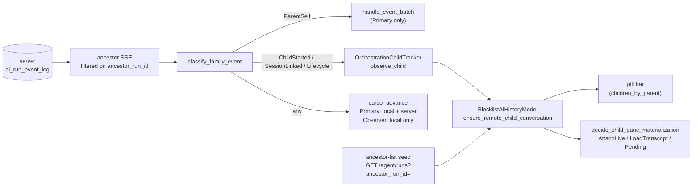

# TECH: Unified Orchestration Child Stack

## 1. Overview
An orchestrated agent run is a parent (orchestrator) run plus a set of direct
child runs. The unified orchestration child stack is the client machinery that
answers two questions for any orchestrator the user has open:

1. **Which children exist?** — discovery.
2. **What should this child's pane show right now?** — materialization.

**The concrete problem this work addresses:** when a cloud-hosted orchestrator
calls `run_agents`, the children execute in a separate sandbox that the local
Warp client never created. For a shared-session viewer of that orchestrator the
client's process also never created the children. In both cases the children
must be discovered by the client rather than found in its local state.

It solves two problems:

**(a) Real-time child discovery during a live run.** The client discovers every
child from a single server-sent event stream on the parent's run — regardless
of which process created the child — with no polling, surfacing each as a named
pill with live status.

**(b) Restore of the pill bar and child panes after a restart.** Cloud child
runs and shared-session parent views are ephemeral cloud state and are
deliberately not written to the local database. After a restart the client
rebuilds the parent→child relationship from the server's ancestor listing and
re-materializes child panes through the same dispatch used during a live run.

**M1 scope.** This PR establishes the core machinery: the family-stream
classification (`drain_family_events`, `classify_family_event`) that routes SSE
events to the right handler, and the `OrchestrationChildTracker` that manages
per-child state. Pane materialization and the restore seed path land in M2,
which builds directly on this foundation.

Everything below is gated by `FeatureFlag::OrchestrationUnifiedStack`
(`crates/warp_features/src/lib.rs:715`, listed in `DOGFOOD_FLAGS`). With the
flag off, the client takes the separate owner and viewer paths described in §8.

The moving parts:

## 2. Core concepts
**Run / task.** A server-side agent run, identified by a `run_id` (the
stringified `AmbientAgentTaskId`). Client-side an `AIConversation` may be linked
to a run through its `run_id` / `task_id`.

**Parent (orchestrator) and direct child.** A child run carries
`parent_run_id = P`. The tree is one level deep: a run is either a root
orchestrator or a leaf child. The server's ancestor query is single-level
(`parent_run_id = $1`), and the client's discovery, seed, and pane paths all
assume the same shape.

**`is_remote_child`.** The marker on an `AIConversation` for "this conversation
is a local stand-in for a run executing elsewhere". It is set on every
placeholder the client materializes for a cloud child, on both the owner and
the viewer side. It has two consequences:
- The conversation is never persisted to SQLite
  (`app/src/ai/agent/conversation.rs:3485`). Remote children are rediscovered
  from the server on restore, so a persisted row could only go stale.
- The streamer treats the conversation as a passive view of a run hosted
  elsewhere (`is_remote_run_view`), so it never opens a per-child SSE or writes
  the server-side cursor for that run. The child's events already arrive on the
  parent's stream.

In-process children are the complement: they own a real local conversation with
a real hidden terminal pane, are persisted normally, and carry
`is_remote_child = false`.

**Primary mode vs Observer mode (`FamilyDrainMode`).** One enum
(`app/src/ai/blocklist/orchestration_event_streamer.rs:339`) captures the only
two behavioral differences between the process that hosts an orchestrator
conversation and a process watching one through a shared session:

- **Primary** — hosts the orchestrator conversation. Delivers the parent's own
  events (inbox messages and parent lifecycle) into the parent's
  `OrchestrationEventService`, and is the authoritative writer of the run's
  server-side event cursor (`persist_cursor_local_and_server`).
- **Observer** — watches through a shared session. Drops parent-self events —
  it has no inbox to deliver them to — and persists the cursor to SQLite only
  (`persist_cursor_local_only`), so a viewer can never fast-forward the owner's
  resume point.

The mode describes event-consumption role and cursor responsibility only. It
says nothing about authenticated task ownership, conversation permissions, or
what a pane is allowed to do.

**`OrchestrationUnifiedStack` scope.** The flag gates: the unified family drain
and its classification, the tracker, remote-child placeholder creation from the
drain, the ancestor-list restore seed, and the task-driven pane dispatch. With
the flag off none of that code runs.

## 3. Child discovery (live session)
The server records an append-only event log per run with a monotonic global
`sequence`. Three event types matter here:

- `child_agent_started` — emitted on the **parent** run when a task is created
  with `parent_run_id` set. The new child's run id is carried in `ref_id`.
- `run_session_linked` — emitted on the **child** run when its sandbox session
  is linked. The session UUID is carried in `ref_id`.
- lifecycle events (`run_in_progress`, `succeeded`, `failed`, …) and
  `new_message`.

A parent conversation with an orchestration role subscribes with
`AgentEventFilter::AncestorRunId { ancestor_run_id: self_run_id, include_self:
true }` (`desired_sse_filter`). One connection carries the parent's own inbox,
child lifecycle, and child discovery events, so the filter never has to widen
and the single scalar cursor always covers the whole watched set.

`drain_family_events` classifies each buffered event with
`classify_family_event(event, self_run_id)` into a `FamilyEvent`:

- `ChildStarted { child_run_id }` — `child_agent_started` on the parent's run.
- `ChildSessionLinked { child_run_id, session_uuid }` — `run_session_linked` on
  another run.
- `ChildLifecycle { child_run_id, kind }` — a recognised lifecycle event on
  another run.
- `ParentSelf(event)` — `new_message` or a recognised lifecycle event on the
  parent's own run.
- `Opaque` — anything else. Advances the cursor only, which keeps unknown
  server event types forward-compatible.

### 3.1 `ChildStarted`
Two things happen, in order:

1. `ensure_remote_child_placeholder` fetches the child's task metadata and
   creates the local placeholder through
   `BlocklistAIHistoryModel::ensure_remote_child_conversation`, so the pill bar
   shows a correctly named child as soon as the fetch lands. It is a no-op when
   the history model already knows the run id, and it is skipped in Primary
   mode for a passive remote view, which must not impersonate the owning
   process.
2. `tracker.observe_child(run_id, ChildSignal::Started, killed_run_ids, ctx)`
   records the child in tracker state.

### 3.2 `OrchestrationChildTracker`
`observe_child` (`app/src/ai/blocklist/orchestration_child_tracker.rs:118`) is
the single entry point for every child state change. It first drops the signal
if the run is tombstoned (locally killed), which is what makes a kill immune to
a late event or an in-flight fetch resurrecting the child. Then it dispatches on
the signal:

- **`Started`** — a known child keeps hydrating (refetch while incomplete, then
  request a pane); an unknown child starts a deduplicated metadata fetch. The
  fetch guard makes repeat `Started` signals for the same run idempotent.
- **`SessionLinked { session_uuid }`** — fills in `session_id` directly and
  requests pane materialization, skipping the metadata round trip entirely. If
  the placeholder does not exist yet the session id is stashed in
  `pending_session_ids` and applied when the child is created.
- **`Lifecycle(kind)`** — the tracker is the sole status writer for placeholder
  children: it writes the mapped `ConversationStatus` through to the history
  model so the pill badge updates immediately, and emits `ChildStatusChanged`.
  A lifecycle event for an unknown run falls through to a metadata fetch, which
  makes lifecycle a complete self-healing backstop for a missed
  `child_agent_started`.
- **`Seeded(task)`** — a task row from the metadata cache or a REST listing.
  Creates the `TrackedChild` if new, otherwise refreshes `last_state` and fills
  in a missing `session_id`.
- **`Registered`** — a child created in this process. It already owns a real
  local conversation, so it is recorded in `in_band_children`, marked
  `is_remote_child: false`, and never issued a discovery fetch; later
  `Started` / `Lifecycle` signals for it become plain status updates.

`TrackedChild` holds exactly what the state machine needs: `session_id`
(`None` until execution is claimed), `last_state`, `is_remote_child`, and
`last_lifecycle` (the most recent SSE lifecycle event type received for this
child, if any). `last_lifecycle` is used by the placeholder-completion path to
backfill terminal status when a lifecycle event arrives via SSE before the
async metadata fetch creates the conversation in the history model.
`ChildSpawned` is emitted exactly once per child, from `insert_child`.

All tracker metadata fetches route through
`AgentConversationsModel::get_or_async_fetch_task_data`, which is the single
fetch authority for task data: it dedupes in-flight requests per task id, backs
off separately after transient and permanent failures, caches results, and
emits `TasksUpdated` when fresh data lands. A cache hit resolves the child
inline; a miss leaves the tracker's guard set and a later signal — or the
`TasksUpdated` re-drive — completes discovery against a warm cache.

### 3.3 Keeping the task cache honest
Two drain-side cache updates keep `decide_child_pane_materialization` from
acting on a stale snapshot taken at discovery time, when the child was still
`Queued`:

- on `ChildSessionLinked`, `update_task_as_running_with_session` writes the
  session id onto the cached task and promotes a queued/pending/claimed state to
  `InProgress`, never downgrading a terminal state that arrived concurrently;
- on a terminal `ChildLifecycle`, `evict_and_refetch_task` drops the cached
  entry and refetches, so the refreshed row carries the server conversation
  token needed for a transcript.

### 3.4 Reaching the pill bar
Placeholders are linked to their parent through
`BlocklistAIHistoryModel::set_parent_for_conversation`, which maintains the
`children_by_parent` index. The pill bar renders straight off that index, so a
child becomes visible the moment `ensure_remote_child_conversation` returns.

## 4. Child pane materialization
`decide_child_pane_materialization(task)`
(`app/src/pane_group/child_agent/materialization.rs:26`) is the single dispatch
point. It is a free function over an `AmbientAgentTask` — origin-agnostic and
side-effect free, so identical task state always produces the same action, and
owner-side and viewer-side children cannot drift apart:

- **`AttachLive { session_id }`** — the task reports an attachable live session.
  `attach_ambient_orchestration_child_session` builds a pane that joins that
  shared session from the start, discards any loading pane already showing for
  the child, and swaps the replacement into the same anchor only once its
  session manager, ambient model, and conversation are wired up, so the user
  never sees a half-built pane. The joined session's role is what governs
  whether input is allowed.
- **`LoadTranscript { server_token }`** — the run is terminal and has a
  non-empty server conversation token. `hydrate_child_transcript` loads the
  cloud transcript, merges it into the placeholder, then chooses the
  presentation from the caller's access to the conversation:
  `CompletedChildPresentation::Continuation` restores the continuation-capable
  ambient cloud-mode pane when access is `Edit` and the task source permits
  cloud follow-ups; otherwise `PassiveTranscript` renders a read-only transcript
  with a conversation-ended tombstone.
- **`Pending`** — neither an attachable session nor a loadable transcript. The
  child gets (or keeps) a loading placeholder and is recorded in
  `pending_child_hydrations`. `process_pending_child_hydrations` re-drives it on
  the next `TasksUpdated`, re-running the same dispatch.

A live join that fails is recorded in `failed_viewer_child_sessions`. The same
dead session is never retried; the child returns to pending and the pane is
marked live-unavailable, and refreshed task data can later upgrade it to a
transcript or attach a subsequent execution
(`recover_viewer_child_join_failure`).

Entry points converge on this dispatch:
`materialize_child_pane` (from restore, given a placeholder conversation),
`materialize_viewer_child_pane_from_task` (from a viewer's `TerminalView`
event), and `process_pending_child_hydrations` (re-drive) all end in
`apply_child_pane_materialization`.

### 4.1 Discovery and materialization by parent/child type
"Local" vs "remote" means different things on each side of the pair. For the
**parent** it means whether the user is running the orchestrator locally or
watching it as a shared-session viewer. For the **child** it means whether the
child runs in-process (local) or as a separate cloud task (remote,
`is_remote_child = true`).

**1. Local parent / local child.** The parent is a local Warp agent and the
child is spawned in-process. `create_hidden_child_agent_conversation` creates a
real child conversation (`is_remote = false`) with a hidden terminal pane, and
it is persisted normally. Discovery needs no server round trip — the executor
creates the conversation directly. On restore the conversation is loaded from
the database, `restore_missing_child_agent_panes_for_parent` finds it in
`children_by_parent` from the startup index, and `create_hidden_child_agent_pane`
takes the local branch: a hidden terminal pane restoring the child conversation.
Task-driven dispatch is not involved.

**2. Local parent / remote child.** The parent is a local Warp agent; the child
is dispatched to a cloud runner. The child conversation is a placeholder with
`is_remote_child = true` and is not persisted. Discovery is live:
`child_agent_started` on the parent's ancestor SSE →
`ensure_remote_child_placeholder` + `observe_child(Started)` → placeholder in
`children_by_parent` → pill. Clicking the pill runs
`decide_child_pane_materialization`. On restore the parent comes back with no
remote children in its index, so `restore_missing_child_agent_panes_for_parent`
triggers the ancestor-list seed (§5) and the children are rediscovered from the
server.

**3. Remote parent / local child.** The parent is a cloud agent the user is
watching as a shared-session viewer; the child runs in-process inside that
cloud run. From the viewer's perspective the child is another run it can only
observe. Discovery is either the `OrchestrationViewerModel` ancestor seed at
startup or a live `child_agent_started` on the ancestor stream, both of which
land in `OrchestrationViewerModel::register_child`, which creates the
placeholder through `ensure_remote_child_conversation`. Materialization goes
through the same dispatch; while the run is live this resolves to `AttachLive`
and joins the child's shared session.

**4. Remote parent / remote child.** A cloud agent that spawns another cloud
agent. Discovery is identical to (3) — the viewer cannot distinguish the two,
which is the point. Materialization resolves to `AttachLive` while the child is
running and to `LoadTranscript` once it completes.

Cases 2, 3, and 4 all converge on one placeholder flavor, one discovery funnel,
and one pane dispatch. Case 1 is deliberately different: a real local
conversation with a real terminal needs neither a placeholder nor a task fetch.

## 5. Restore (after restart)
Remote child conversations and shared-session parent conversations are not
persisted (`write_updated_conversation_state` returns early for
`is_viewing_shared_session` or `is_remote_child`). After a restart the client
therefore starts with no knowledge of a parent's cloud children and rebuilds it
from the server.

`restore_missing_child_agent_panes_for_parent(parent_conversation_id,
parent_pane_id, trigger_seed_if_empty, ctx)` runs when a parent agent view is
restored or entered fullscreen. It reads the parent's children from
`children_by_parent` and, when `trigger_seed_if_empty` is set and no seed is
already pending for this parent in `pending_parent_child_seeds`, kicks off the
ancestor-list seed. The seed is always triggered regardless of how many remote
children are already known locally — some may be missing if the flag state
changed between sessions (e.g. a child persisted under flag-off that is now
missing flag-on siblings).

`seed_child_conversations_from_task` records the parent in
`pending_parent_child_seeds`, ensures the shared `TasksUpdated` subscription is
installed, and issues `GET /agent/runs?ancestor_run_id=<parent_task_id>` with a
limit of 100 (the server's cap).

`finish_seed_child_conversations_from_task` applies the response:

- a fetch error leaves the pending entry in place so
  `process_pending_parent_child_seeds` retries on the next `TasksUpdated`;
- the parent's own row is skipped (the ancestor endpoint includes it);
- each child's task data is resolved through the shared cache, and each
  resolved child is linked under the parent with
  `ensure_remote_child_conversation` — idempotent, so racing the SSE family
  drain or a repeat seed costs nothing;
- if any child's task data is still being fetched the parent stays pending;
  otherwise the pending entry is cleared;
- finally it calls `restore_missing_child_agent_panes_for_parent` with
  `trigger_seed_if_empty = false` so panes materialize in the same pass.

Children linked this way land in `children_by_parent`, and the pill bar renders
off that index. Children registered before the parent's run id was known have
their `parent_agent_id` backfilled when the parent's
`ConversationServerTokenAssigned` history event fires, which is also what
prompts the streamer to re-evaluate the parent's stream eligibility now that a
`self_run_id` exists.

The seed also runs directly from the cloud-agent restore paths
(`load_data_into_transcript_viewer` and
`replace_loading_pane_with_restored_ambient_cloud_mode_pane_inner`), after the
pane swap so the parent's pane is resolvable when children materialize.

## 6. Observer mode (viewer discovering children)
When a viewer joins a shared session and the session's source identifies it as
an ambient agent run, `NetworkEvent::JoinedSuccessfully` creates an
`OrchestrationViewerModel` for the parent task
(`app/src/terminal/shared_session/viewer/terminal_manager.rs:899`). The model is
per pane; durable child identity is shared through `BlocklistAIHistoryModel`,
and the streamer is a process-wide singleton.

The model registers itself as a viewer-mode consumer for the parent task once
the pane's active conversation is the orchestrator placeholder. Registration is
refcounted: several viewer panes on the same parent share one entry and one SSE,
and the entry (with its SSE) is torn down when the last consumer unregisters.

On first registration the streamer issues the cold-start ancestor seed
(`spawn_ancestor_seed_fetch`): `GET /agent/runs?ancestor_run_id=<parent>`. Each
returned child is recorded in `known_children`, the cursor is advanced to the
highest `last_event_sequence` seen, and `ChildSpawned` is emitted for each. Only
after the seed lands does the ancestor SSE open, resuming from that cursor, so
replayed events for already-known children do not produce duplicate spawns. A
failed seed is not retried on a timer; the next consumer registration or
reconnect re-issues it.

Live discovery then runs through the same family drain in
`FamilyDrainMode::Observer`: `child_agent_started`, `run_session_linked`, and
child lifecycle events all flow into the tracker, `ChildSpawned` /
`ChildStatusChanged` reach the viewer model, and the cursor is persisted locally
onto every registered placeholder and never pushed to the server. The observer's
connection is opened with `include_self: false` — a viewer has no use for the
orchestrator's inbox — and the drain drops `ParentSelf` events regardless, so
the behavior does not depend on the wire filter.

`OrchestrationViewerModel::register_child` creates the placeholder through
`ensure_remote_child_conversation`, writes status through on change, and asks
the parent's `TerminalView` to materialize the child pane by emitting
`EnsureUnifiedViewerChildPane { conversation_id, task }`. Carrying the task
snapshot is what lets the pane group run the same
`decide_child_pane_materialization` dispatch the owner side uses, instead of
only being able to act on a raw session id. A short poll re-fetches metadata for
children that are not yet materializable, which covers the window between a
child being created and its sandbox session being linked.

## 7. Cursor authority
Each family stream has one cursor: the highest fully-handled `sequence`.
Reconnects resume from it (`since=`).

- Primary persists to SQLite and pushes to the server. The push happens even
  when a batch contained only child events, so the parent's resume point never
  lags behind its own stream.
- Observer persists to SQLite only, folding in the conversation's
  already-persisted value so the write stays monotonic, and mirrors the advanced
  cursor onto every registered viewer placeholder.

`Opaque` events advance the cursor without any other effect, so an unrecognised
server event type can never wedge a stream.

## 8. Flag-off path
With `OrchestrationUnifiedStack` disabled the client takes the per-conversation
owner drain and the ancestor-only viewer drain, and none of the unified code
runs. This code is unmodified by the unified stack; both dispatchers pick a path
and nothing else in the flag-off branches is touched.

- `drain_owner_events` → `drain_sse_events`: the per-conversation drain feeds
  `handle_event_batch` directly and persists the cursor locally and to the
  server.
- `drain_viewer_events` → `drain_ancestor_events`: the ancestor-only drain
  emits `ChildSpawned` / `ChildStatusChanged` from `known_children`, drops
  `new_message`, and persists the cursor to every viewer placeholder.
- Viewer children are created as `is_viewing_shared_session` conversations by
  `OrchestrationViewerModel`, which fetches task metadata with its own
  in-flight guard and emits `EnsureSharedSessionViewerChildPane` once a raw
  `session_id` is available; `ensure_shared_session_viewer_child_pane` builds
  the per-child viewer pane.
- Owner-side remote children restore through
  `hydrate_task_backed_hidden_child_pane`, whose action is chosen by
  `decide_remote_child_hydration_action` (`LiveAttach` / `LoadTranscript` /
  `Fallback`), with pending entries re-driven by
  `process_pending_remote_child_hydrations`.
- `seed_child_conversations_from_task`, `process_pending_parent_child_seeds`,
  and `process_pending_child_hydrations` all return immediately, so no seed runs
  and no pending map is populated.

## 9. Key invariants
**`is_remote_child` is set before the first database write, or the child is
never written at all.** `start_new_child_conversation` takes `is_remote` and
applies it before its initial `persist_conversation_state`
(`app/src/ai/blocklist/history_model.rs:542`). Setting the marker after that
first persist would write a row with `is_remote_child = false` and
`run_id = None`, and the persistence guard would then block every later,
correct write for that conversation — leaving a permanently wrong row on disk.

**`trigger_seed_if_empty` is `false` when
`finish_seed_child_conversations_from_task` calls back into
`restore_missing_child_agent_panes_for_parent`.** That call is itself the
completion of a seed. A parent that legitimately has no children would otherwise
see an empty child list, start another seed, complete it empty, and loop
forever. Every entry point that is *not* downstream of a seed completion passes
`true`.

**The ancestor seed never retries on a completed empty result.** A successful
fetch whose children all resolved — including the zero-children case — clears
the parent's `pending_parent_child_seeds` entry. Only a fetch error or a child
whose task data is still in flight leaves the entry pending for
`process_pending_parent_child_seeds` to re-drive.

**Tombstoned runs are gated before any side effect.** The tombstone check is
the first thing `observe_child` does, ahead of placeholder creation, status
writes, and pane requests, so a kill cannot be undone by a late event or a
metadata fetch that was already in flight.

**Placeholder creation is idempotent and has one authority.**
`ensure_remote_child_conversation` is the only way a remote-child placeholder
and its run-id mapping come into existence. The drain's placeholder callback,
the viewer model's metadata callback, and the restore seed can all race; each
either creates the mapping or adopts the existing one, so exactly one named
conversation ever occupies `agent_id_to_conversation_id` for a run.

**Pane materialization is idempotent.** Every materialization entry point first
checks whether the child already has a live tracked pane in `child_agent_panes`
and returns if so, rather than creating a second pane and orphaning the first.
